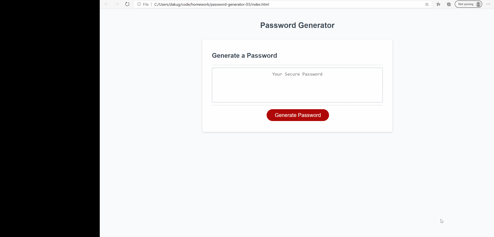
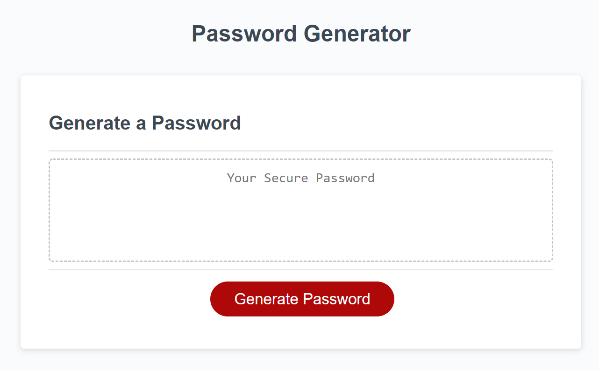

# password-generator-03

## Description 

This application is a random password generator. The user of the site will be able to select specific parameters needed for the password such as:

* Length of desired password (ranging from 8 characters to 128 characters)
* Needing or not needing lowercase letters
* Needing or not needing uppercase letters
* Needing or not needing numbers 
* Needing or not needing special symbols 

## Table of Contents 

* [Installation](#installation)
* [Video](#video)
* [Usage](#usage)
* [Credits](#credits)
* [License](#license)
* [Questions](#questions)

## Video

The video shows the working application. The user can select the needed parameters of the password and it will be generated. 

## Installation

Steps to install my project include:
* npm install the dependencies 

## Usage 

* Main page that the user sees when they first go the site. Once the button is clicked the user will be prompted to put in specific password parameters. 

## Credits

All of the code was developed by Dana Kuglin. Information about her GitHub profile and how you can contact her are listed below in the questions section. 
 

## License

This project is licensed under MIT.

## Questions

GitHub Username: dakuglin
GitHub Profile: (https://github.com/dakuglin)

Please email me with additional questions at dakuglin@gmail.com  

    

